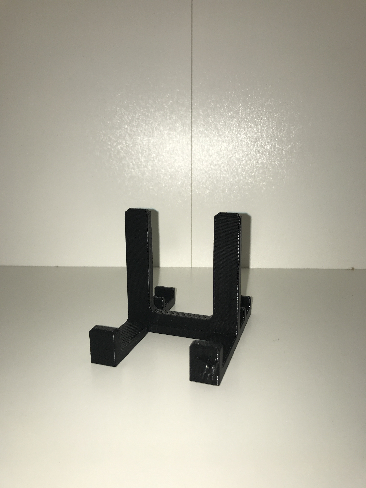
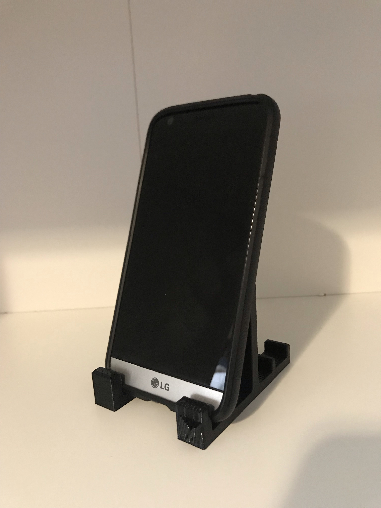
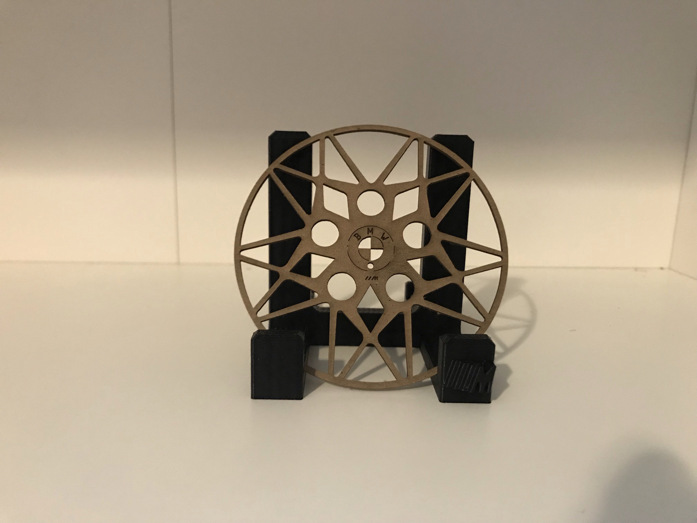

# Cell_Phone_Model
3D modelled cell phone kit able to hold any mobile phone in various positions and angles

The design logo was inspired from **BMW M Model Series**.

## Design Overview
This phone stand has 3 different angle positions, each able to support a phone in either portrait or landscape orientation. All corners and edges have fillets or chamfers to add an extra smooth finish, and the H-shaped flat base allows the phone stand to remain balanced despite any unbalanced forces that may act on it (ie tapping it/accidentally hitting it)

If you like the design, feel free to print it and share with your friends!

## Test with LG G5

## Showcase

**Note** that if you like the laser cut BMW M4 rim, that file is available [here](https://github.com/wshahbaz/Cell_Phone_Model/blob/master/Snowflake.dwg)
